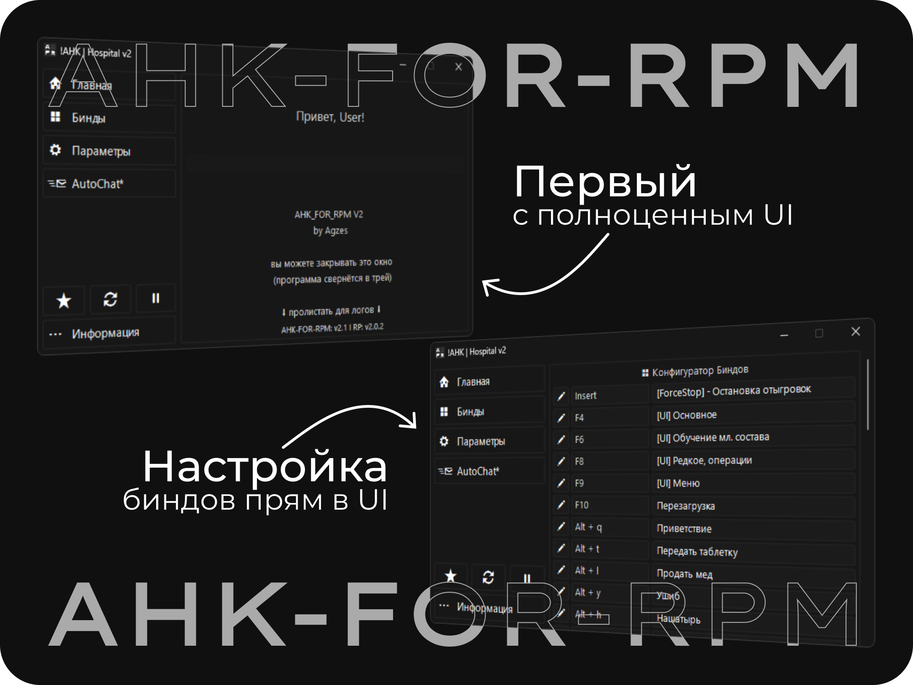
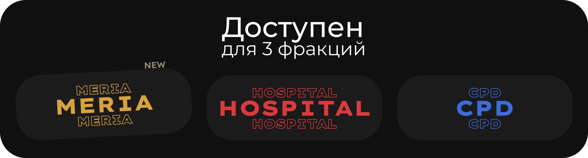
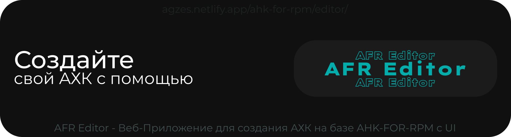

<h4 align="center"><a href="https://github.com/Agzes/AHK-FOR-RPM/releases/tag/latest">[последние релизы]</a> <a href="nextsteps.md">[2.2 | Будущее обновление]</a></h4>

<h4 align="center">*Кликабельно</h4>

<h4 align="center">для работы в полноэкранном режиме minecraft необходимо скачать мод:   <a href="https://www.curseforge.com/minecraft/mc-mods/borderless/download/4858950">[Forge]</a> | <a href="https://www.curseforge.com/minecraft/mc-mods/cubes-without-borders/download/5496358">[Fabric]</a> </h4>

    

<h1 align="center">

Credits: [Agzes/AHK-FOR-RPM/CREDITS.md](https://github.com/Agzes/AHK-FOR-RPM/blob/main/CREDITS.md)
</h1>
<h6 align="center">Made with 💟 by Agzes

